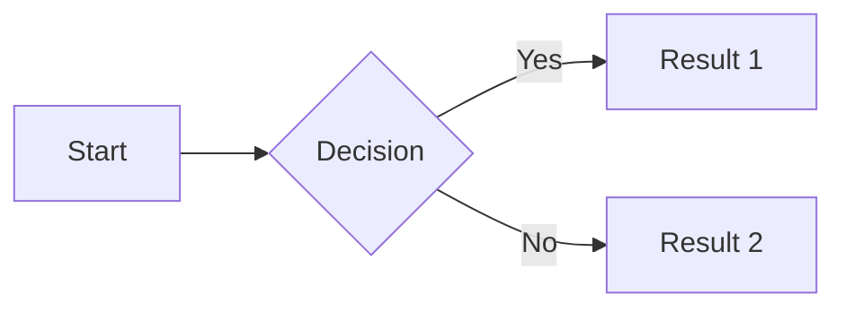

# Retype Documentation Authoring Reference (AI Agent)

You are writing documentation for a **Retype** project. Retype is a static site generator that transforms Markdown `.md` files into a polished website. Beyond standard Markdown, Retype provides many powerful components and configuration options. **Always prefer Retype-specific components over plain Markdown when they improve readability or navigation.**

---

## Project Structure

```
project-root/
├── retype.yml              # Project configuration (required)
├── README.md               # Home page
├── _includes/              # Reusable snippets & injected HTML
│   ├── head.html           # Injected into <head> on every page
│   ├── head-top.html       # Injected at top of <head>
│   ├── body.html           # Injected into <body>
│   ├── body-top.html       # Injected at top of <body>
│   ├── top.md              # Content at top of every page
│   ├── bottom.md           # Content at bottom of every page
│   └── snippets/           # Reusable markdown/HTML partials
├── static/                 # Images, CSS, downloadable files
├── guides/                 # Example content folder
│   ├── index.yml           # Folder-level config
│   └── getting-started.md
└── blog/                   # Blog posts folder
```

Default/home pages (auto-detected): `readme.md`, `index.md`, `default.md`, `welcome.md`, `home.md`.

---

## Page Frontmatter (YAML Metadata)

Every `.md` page can have a YAML frontmatter block at the top. Key properties:

```yaml
---
label: Custom Nav Label     # Label shown in navigation sidebar
icon: rocket                # Octicon name, emoji ":rocket:", SVG, or image path
order: 100                  # Navigation order (higher = higher position, negative = bottom)
layout: default             # default | page | central | blog
visibility: public          # public | hidden | protected | private
tags: [guide, setup]        # Tags (auto-generates tag index pages)
category: tutorials         # Category (auto-generates category pages)
date: 2024-01-15            # Publish date (yyyy-mm-dd), used for blog ordering
author: Jane Smith          # Author name, email, or object with name/email/link/avatar
image: ../static/hero.jpg   # Feature image for page previews/cards
expanded: true              # Expand folder in nav (only in index.yml)
redirect: other-page.md     # Redirect this page to another
permalink: /custom/url      # Custom URL path override
description: "Page summary" # Used in page previews (cards, blog listings)
templating: false            # Disable template processing for this page
meta:
  title: "Custom SEO Title"
  description: "Meta description for SEO"
nav:
  badge: NEW|info           # Badge in nav sidebar (PRO). Shorthand: text|variant
toc:
  depth: 2-4                # Table of contents heading depth (PRO)
  label: "On this page"
backlinks:
  enabled: true             # Show backlinks (PRO)
  title: "See also"
  maxResults: 5
---
```

Separate `.yml` file alternative: `page-name.yml` alongside `page-name.md` with the same options.

Folder configuration: place `index.yml` inside a folder with `label`, `icon`, `order`, `expanded`, `visibility`, `permalink`.

---

## Components Reference

### Callout / Alert

Highlight important information. Surround content with `!!!`.

```md
!!!
Default callout (primary variant).
!!!

!!!danger Warning Title
Critical information here. Supports **markdown** inside.
!!!

!!!success
This is a success callout.
!!!
```

**Variants:** `base`, `primary` (default), `secondary`, `success`, `question`, `tip`, `danger`, `warning`, `info`, `light`, `dark`, `ghost`, `contrast`

**Syntax:** `!!!variant Optional Title`

**GitHub Alerts** are also supported:

```md
> [!NOTE]
> Useful information that users should know.

> [!TIP]
> Helpful advice for doing things better.

> [!IMPORTANT]
> Key information users need to know.

> [!WARNING]
> Urgent info that needs immediate attention.

> [!CAUTION]
> Advises about risks or negative outcomes.

> [!NOTE] Custom Title
> Note with a custom title.
```

Custom attributes: `!!!warning Title {#my-id .my-class}`

---

### Tabs

Tabbed content blocks. Wrap with `+++`.

```md
+++ Tab 1
Content for first tab.
+++ Tab 2
Content for second tab.
+++ Tab 3
Third tab content.
+++
```

Title must be separated from `+++` by a space. Custom attributes: `+++ Tab 1 {#custom-id .highlight}`

Tabs are anchored — link to them: `[Go to Tab 2](#tab-2)`

#### Code Group (Tabbed Code Blocks)

```md
+++ JavaScript
\```js
console.log("Hello");
\```
+++ Python
\```py
print("Hello")
\```
+++ Bash
\```bash
echo "Hello"
\```
+++
```

---

### Panel (Accordion / Collapsible)

Expandable/collapsible content sections. Wrap with `===`.

```md
=== Panel Title
This panel is expanded by default.
===

==- Collapsed Panel
This panel starts collapsed. Click to expand.
===
```

**Stacking** multiple panels (accordion):

```md
==- FAQ Question 1
Answer to question 1.
==- FAQ Question 2
Answer to question 2.
==- FAQ Question 3
Answer to question 3.
===
```

Custom attributes: `=== Panel Title {#my-panel .highlight}`

---

### Steps

Numbered step-by-step instructions. Wrap with `>>>`.

```md
>>> Create the project
Initialize a new project.

>>> Install dependencies
Run the install command.

>>> Start the server
Launch the dev server.
>>>
```

Custom start number: `>>> 5. Step title` (starts numbering at 5).

Steps support nested components (tabs, code blocks, callouts inside steps).

---

### Badge

Inline styled label. Uses link syntax with `!badge` prefix.

```md
[!badge Badge Text]
[!badge variant="success" text="Stable"]
[!badge Stable|success]
[!badge variant="danger" icon="alert" text="Breaking"](https://example.com)
[!badge size="s" corners="pill" text="Beta"]
```

**Properties:** `text`, `variant`, `size` (xs/s/m/l/xl/2xl/3xl), `corners` (round/square/pill), `icon`, `iconAlign` (left/right), `target`

**Variants:** `base`, `primary`, `secondary`, `success`, `question`, `danger`, `warning`, `info`, `light`, `dark`, `ghost`, `contrast`

---

### Button

Interactive button. Uses link syntax with `!button` prefix.

```md
[!button Click Me](https://example.com)
[!button variant="success" text="Download" icon="download"](https://example.com)
[!button text="Send" corners="pill" size="l"](https://example.com)
[!button target="blank" text="External Link"](https://example.com)
```

Same properties as Badge: `text`, `variant`, `size`, `corners`, `icon`, `iconAlign`, `target`.

---

### Card

Preview card linking to another page. Automatically shows title, description, date, and image.

```md
[!card](path/to/page.md)
[!card vert](path/to/page.md)
[!card layout="vertical"](path/to/page.md)
```

Multiple vertical cards create a responsive grid:

```md
[!card vert](page1.md)
[!card vert](page2.md)
[!card vert](page3.md)
```

---

### Reference Link

Prominent link block to another page. Uses `!ref` prefix.

```md
[!ref](getting-started.md)
[!ref Custom Link Text](getting-started.md)
[!ref icon="rocket" text="Launch Guide"](getting-started.md)
[!ref target="blank" text="External Docs"](https://example.com)
```

---

### File Download

Download link component. Uses `!file` prefix.

```md
[!file](static/document.pdf)
[!file Download Report](static/report.xlsx)
[!file icon="package" text="Source Code"](static/source.zip)
```

---

### Column Layout

Equal-width columns. Wrap with `|||`.

```md
||| Column 1
Content for first column.
||| Column 2
Content for second column.
||| Column 3
Content for third column.
|||
```

Title required per column. Supports icons/emojis in titles: `||| :icon-check-circle: Done`

**Code Column:** A column containing only a code block gets special styling (ideal for demo/source side-by-side).

---

### Container (Custom Div)

Wraps content in a `<div>` for custom CSS styling. Use `:::`.

```md
:::text-center
This text is centered.
:::

:::content-center
[!button Centered Button]
:::

:::my-custom-class
Content with custom styling.
:::
```

Add CSS via `<style>` blocks or `_includes/head.html`.

Custom attributes: `::: {#my-id .custom-class}`

---

### Code Block

Standard fenced code blocks with Retype enhancements.

````md
```js
const x = 1;
```

```js Title of code block
const x = 1;
```

```js #
// Line numbers enabled
const x = 1;
```

```js #2
// Highlight line 2
const a = 1;
const b = 2;
const c = 3;
```

```js #2-3,5-7
// Highlight multiple ranges
```

```js !#2-3
// Highlight without line numbers
```
````

**Line highlighting syntax:** `#2` (single), `#2-5` (range), `#2,4-8` (mixed), `!#4-8` (no line numbers)

**Attribute syntax:** `` ```js:highlight="2-3,5-7" ``

Custom attributes: `` ```js {#example-code .highlight} ``

---

### Code Snippet (File Include)

Include content from another file into a code block.

```md
:::code source="path/to/file.js" :::
:::code source="path/to/file.js" range="1-10" :::
:::code source="path/to/file.js" range="5-15" title="Example" language="js" :::
```

**Properties:** `source` (path), `range` (line numbers), `title`, `language`, `region` (C# #region name)

---

### Image

Standard Markdown images with Retype enhancements.

```md


          <!-- width x height -->
              <!-- width only -->
{.rounded-lg width="300"}  <!-- custom attributes -->
```

**Alignment:**

```md
              <!-- center (default) -->
-             <!-- float left -->
-             <!-- float right -->
--            <!-- float left plus (wider) -->
--            <!-- float right plus (wider) -->
----          <!-- center plus (wider) -->
```

**Image as link:** `[](https://example.com)`

---

### Mermaid Diagrams

Use fenced code blocks with `mermaid` language.

````md

````

**Supported diagram types:** flowchart, sequence, gantt, class, entity-relationship, user journey, kanban, sankey, architecture, XY chart.

**Directives:** `%%{init: { 'theme': 'forest' }}%%` as first line inside block.

**Syntax highlighting only** (no render): use `mermaid-js` as language.

---

### Math Formulas (LaTeX/KaTeX)

```md
Inline: $E = mc^2$

Block (centered):
$$
\sum_{i=1}^{n} x_i = x_1 + x_2 + \cdots + x_n
$$
```

Syntax highlighting: use `latex` as code block language.

---

### YouTube Video Embed

Simply paste a YouTube URL on its own line:

```md
https://www.youtube.com/watch?v=VIDEO_ID
https://youtu.be/VIDEO_ID
```

Parameters: `&autoplay=1`, `&loop=1`, `&controls=0`, `&mute=1`, `&start=30&end=60`, `&t=30s`

---

### Generic Embed

Embed any iframe content (videos, maps, etc.).

```md
[!embed](https://www.youtube.com/embed/VIDEO_ID)
[!embed aspect="4:3"](https://example.com/embed)
[!embed width="300" height="200" text="Caption"](https://example.com)
[!embed el="video"](https://example.com/video.mp4)
```

**Properties:** `allowFullScreen`, `aspect` (1:1, 4:3, 16:9, 21:9), `el` (iframe/embed/video/object), `height`, `width`, `text`

---

### Emoji & Icons

**Emoji:** Use `:shortcode:` syntax. E.g., `:rocket:` → 🚀, `:thumbsup:` → 👍

**Octicons (Icons):** Use `:icon-name:` syntax. E.g., `:icon-star:`, `:icon-check-circle:`, `:icon-alert:`, `:icon-git-branch:`, `:icon-rocket:`

Icons and emojis work in headings, paragraphs, table cells, panel titles, callout titles, column titles, and more.

Full Octicon list: https://primer.github.io/octicons/

---

### Color Chip

Hex color codes in backticks auto-render with a color preview chip.

```md
The primary color is `#5495f1` and background is `#ffffff`.
```

Supports `#RGB` and `#RRGGBB` formats.

---

### Comments (Hidden Content)

Content between `%%` markers is stripped from output.

```md
This is visible %%and this is hidden%% text.

%%
This entire block is hidden from output.
Multi-line comments work too.
%%
```

---

### Lists (Enhanced)

**Task lists:**

```md
- [x] Completed item
- [ ] Incomplete item
```

**Icon lists** (remove bullet markers):

```md
{.list-icon}
- :icon-check-circle: Completed
- :icon-alert: Warning
- :icon-circle-slash: Blocked
```

**Ordered list variants:**

```md
1. Numbers (default)
a. Lowercase letters
A. Uppercase letters
i. Lowercase Roman numerals
I. Uppercase Roman numerals
```

**Description lists:**

```md
Term 1
: Definition of term 1

Term 2
: Definition of term 2
```

---

### Table (Enhanced)

```md
Name   | Value | Description
:---   | :---: | ---:
Item 1 | Blue  | Left, center, right aligned
```

**Compact table:** `{.compact}` before table or `{.compact}` on header row.

**No-wrap:** `{.whitespace-nowrap}` before table.

**Combined:** `{.whitespace-nowrap .compact}` before table.

---

## Templating

Retype supports Scriban-based templating. Enable via frontmatter `templating: true` (or it is on by default).

### Includes

```md
{{ include "snippets/support" }}
{{ include "components/header" }}
{{ include "../external/readme.md" }}
```

Resolution order: current dir → `_includes`-prefixed → walk up to project root.

**With parameters:**

```md
{{ include "user-card" { name: "Jane", role: "Developer" } }}
```

### Page Properties

```md
{{ page.title }}
{{ page.author }}
{{ page.tags[0] }}
{{ page.date }}
```

### Project Properties

Access retype.yml data:

```md
{{ data.version }}
```

### Escaping

Inline: ``

Page-level: set `templating: false` in frontmatter.

---

## retype.yml (Project Configuration)

Minimal config:

```yaml
input: ./
output: .retype
```

Common settings:

```yaml
input: ./
output: .retype
url: example.com

branding:
  logo: /static/logo.svg
  logoDark: /static/logo-dark.svg
  label: v1.0
  title: My Project

meta:
  title: " - My Project Docs"
  siteName: My Project

theme:
  base:
    base-link-weight: 500
  dark: {}

edit:
  repo: github.com/user/repo

links:
  - text: GitHub
    link: https://github.com/user/repo
    icon: mark-github
    target: blank

footer:
  copyright: "© 2024 My Company"
  links:
    - text: About
      link: about.md

snippets:
  lineNumbers: [js, json, yaml]

blog:
  pageSize: 10

search:
  minChars: 2
  maxResults: 20

generator:
  paths: root

start:
  pro: true

templating:
  enabled: true
  loopLimit: 2000

data:
  version: "1.0.0"
  abbreviations:
    HTML: Hyper Text Markup Language
```

---

## _includes/ Special Files

| File | Purpose |
| --- | --- |
| `_includes/head.html` | Custom `<head>` content (CSS, scripts, meta) on all pages |
| `_includes/head-top.html` | Top of `<head>` element |
| `_includes/body.html` | Custom `<body>` content on all pages |
| `_includes/body-top.html` | Top of `<body>` element |
| `_includes/top.md` | Markdown rendered at top of every page |
| `_includes/bottom.md` | Markdown rendered at bottom of every page |
| `_includes/snippets/*.md` | Reusable content partials via `{{ include }}` |

---

## Custom Attributes (Generic)

Most components support custom `id` and CSS `class` via `{#id .class}` syntax:

```md
## Heading {#custom-heading-id}

{.rounded-lg width="300"}

!!!warning Title {#warning-id .custom-class}
Content
!!!

=== Panel {#panel-id .highlight}
Content
===

- List item {#item-id .item-class}
```

---

## Best Practices for AI Agents

1. **Use callouts** (`!!!`) for important notes, warnings, tips — not plain blockquotes.
2. **Use tabs** (`+++`) for platform-specific instructions (npm/yarn/pnpm, Windows/Mac/Linux).
3. **Use panels** (`===` / `==-`) for FAQ sections and collapsible details.
4. **Use steps** (`>>>`) for sequential instructions instead of numbered lists.
5. **Use badges** for version labels, status indicators, and feature flags.
6. **Use buttons** for primary CTAs and download links.
7. **Use reference links** (`[!ref]`) for prominent page cross-references.
8. **Use file downloads** (`[!file]`) instead of plain links for downloadable assets.
9. **Use code blocks with titles and line highlighting** for educational code examples.
10. **Use mermaid diagrams** for architecture, flows, and relationships.
11. **Use columns** (`|||`) for side-by-side comparisons or demo/source layouts.
12. **Use icons** (`:icon-name:`) in headings and lists for visual hierarchy.
13. **Use card components** (`[!card]`) for linking to related pages with previews.
14. **Set frontmatter** on every page: at minimum `icon`, and optionally `label`, `order`, `tags`.
15. **Use `{.compact}` tables** for dense reference data.
16. **Use description lists** for glossaries and term definitions.
17. **Use `{.list-icon}` with icon lists** for feature lists and status overviews.
18. **Use color chips** in backtick code for documenting color values: `` `#ff5733` ``.
19. **Prefer Retype components** over raw HTML whenever possible.
20. **Use `_includes/snippets/`** for content reused across multiple pages.
