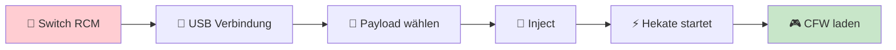

# 🎮 Nintendo Switch V1 - Softmod Guide

  <h2 style="margin-bottom: 0.5rem;">🚀 Der komplette CFW Guide für Switch V1</h2>
  
Von Stock-Firmware zu vollständiger Custom Firmware

---

## ✅ **Was du brauchst**

<h4 style="margin-top: 0; color: #17a2b8;">📋 Hardware-Checklist</h4>

Stelle sicher, dass du <strong>alles</strong> hast, bevor du startest:

<h3>🎮 Hardware</h3>
<ul style="margin: 1rem 0;">
<li>✅ <strong>Nintendo Switch V1</strong> (2017-2018)</li>
<li>📋 <strong>Ungepatcht</strong> (<a href="https://docs.niklascfw.de/switch/vorbereitung/switch_ungepatcht_check/">Serial prüfen</a>)</li>
<li>⚡ <strong>RCM-Jig</strong> (für rechten Joy-Con)</li>
<li>🔌 <strong>USB-C Datenkabel</strong></li>
<li>💻 <strong>Windows PC</strong></li>
</ul>

<h3>💾 Speicher</h3>
<ul style="margin: 1rem 0;">
<li>💽 <strong>microSD-Karte</strong> (256GB - 1TB)</li>
<li>📁 <strong>FAT32 formatiert</strong> (❌ niemals exFAT!)</li>
<li>⚡ <strong>Schnell</strong> (U3 V30 A2)</li>
<li>🏷️ <strong>Samsung EVO Plus, Select und Pro</strong> empfohlen</li>
</ul>

<h3>🛠️ Software</h3>
<ul style="margin: 1rem 0;">
<li>📦 <strong><a href="https://github.com/eliboa/TegraRcmGUI/releases">TegraRcmGUI</a></strong> (aktuell)</li>
<li>🎯 <strong><a href="https://github.com/CTCaer/hekate/releases">hekate.bin</a></strong> (Payload)</li>
<li>🎮 <strong><a href="https://docs.niklascfw.de/switch/niklascfw-pack/">NiklasCFW Pack</a></strong> (empfohlen)</li>
<li>🗜️ <strong><a href="https://www.7-zip.org/">7-Zip</a></strong> (zum Entpacken)</li>
</ul>

## 🎯 **Schritt-für-Schritt Anleitung**

### 📋 **Schritt 1: PC vorbereiten**

<h4 style="margin-top: 0; color: #28a745;">🔧 TegraRcmGUI einrichten</h4>

Das Tool zum Senden der Payloads

**🔧 TegraRcmGUI Installation:**
1. 📥 **[TegraRcmGUI](https://github.com/eliboa/TegraRcmGUI/releases)** als **ZIP** herunterladen
2. 🗜️ ZIP mit **[7-Zip](https://www.7-zip.org/)** entpacken  
3. 🚀 Im Ordner **`TegraRcmGUI.exe`** starten
4. 📁 **`hekate.bin`** bereithalten

<h4 style="margin-top: 0; color: #17a2b8;">💡 Pro-Tipp</h4>

<strong>Doppelklick-Trick</strong>: Du kannst Payloads auch per <strong>Doppelklick</strong> senden - viel schneller als der "Inject"-Button!

---

### ⚡ **Schritt 2: RCM-Modus aktivieren**

<h4 style="margin-top: 0; color: #b8860b;">⚠️ Wichtig</h4>

Der RCM-Modus ist der <strong>einzige Weg</strong> zur CFW für Switch V1

RCM-Jig richtig einsetzen

<h4 style="color: #b8860b;">🎮 RCM aktivieren:</h4>
<ol style="margin: 1rem 0; line-height: 1.6;">
<li>🔴 Switch <strong>vollständig ausschalten</strong></li>
<li>🎯 <strong>RCM-Jig</strong> in rechten Joy-Con-Schacht</li>
<li>⬆️ <strong>Lautstärke +</strong> gedrückt halten</li>
<li>⚡ <strong>Power-Taste</strong> kurz antippen</li>
<li>⏳ <strong>Lautstärke +</strong> weiter halten (3 Sek.)</li>
<li>⚫ <strong>Bildschirm bleibt schwarz</strong> = ✅ RCM aktiv</li>
</ol>

<h4 style="margin-top: 0; color: #28a745;">✅ Erfolg prüfen</h4>

✅ <strong>RCM aktiv</strong> = Bildschirm komplett schwarz (kein Nintendo-Logo!) 
❌ <strong>Fehler</strong> = Nintendo-Logo erscheint → nochmal versuchen

---

### 🚀 **Schritt 3: Payload senden**

<h4 style="margin-top: 0; color: #17a2b8;">🚀 CFW starten</h4>

Jetzt kommt der spannende Teil - CFW laden!

**📡 Payload-Injection:**

1. 🔌 **Switch per USB-C** mit PC verbinden
2. 👁️ **TegraRcmGUI** erkennt Switch als **"RCM device"**
3. 📁 **`hekate.bin`** auswählen (oder per Drag & Drop)
4. 🎯 **"Inject Payload"** klicken **ODER** Datei **doppelklicken**
5. ⚡ Switch bootet automatisch in **Hekate**
6. 🎮 In Hekate **"Launch firmware"** → **"CFW (SYSNAND)"** wählen

---

## ⚠️ **Wichtige Hinweise**

<h4 style="margin-top: 0; color: #dc3545;">🚨 KRITISCH</h4>

Lies das <strong>unbedingt</strong>, bevor du anfängst!

<h4 style="color: #c82333;">🚫 Was du NIEMALS tun solltest:</h4>
<ul>
<li>❌ <strong>exFAT verwenden</strong> (nur FAT32!)</li>
<li>❌ <strong>Alte CFW-Versionen</strong> nutzen</li>
<li>❌ <strong>Online gehen</strong> ohne Schutz</li>
<li>❌ <strong>System-Updates</strong> über Nintendo</li>
</ul>

<h4 style="color: #28a745;">✅ Immer beachten:</h4>
<ul>
<li>💾 <strong>NAND Backup</strong> vor ersten Mods!</li>
<li>🔄 <strong>Aktuelle Versionen</strong> verwenden</li>
<li>📖 <strong>Guides vollständig</strong> lesen</li>
<li>🛡️ <strong>90DNS aktivieren(veraltet)</strong> zum Schutz vor dem Bann</li>
</ul>

<h4 style="color: #e65100;">🔄 Temporärer Softmod:</h4>
<ul>
<li>⚡ <strong>Nach Ausschalten</strong> → Payload neu senden</li>
<li>🔋 <strong>Bei leerem Akku</strong> → Payload neu senden</li>
<li>🎯 <strong>AutoRCM</strong> kann das automatisieren</li>
</ul>

---

## 🎉 **Geschafft! Was jetzt?**

<h4 style="margin-top: 0; color: #28a745;">🎉 CFW läuft!</h4>

Herzlichen Glückwunsch! Deine Switch läuft jetzt mit Custom Firmware.

  <h3>🚀 Nächste Schritte:</h3>
  

    <a href="/switch/system-backup/nand_backup" style="background: white; color: #4caf50; padding: 0.8rem 1.5rem; border-radius: 6px; text-decoration: none; font-weight: bold;">💾 NAND Backup</a>
    <a href="/switch/niklascfw-pack/guide1/" style="background: white; color: #4caf50; padding: 0.8rem 1.5rem; border-radius: 6px; text-decoration: none; font-weight: bold;">🎯 CFW Pack</a>
    <a href="/switch/gut-zu-wissen/spiele/spiele_installation_dbi_sphaira/" style="background: white; color: #4caf50; padding: 0.8rem 1.5rem; border-radius: 6px; text-decoration: none; font-weight: bold;">⚙️ Optimieren</a>
  

### 📋 **Empfohlene Reihenfolge:**
1. 💾 **[NAND Backup erstellen](/switch/system-backup/nand_backup)** - Deine Konsole sichern
2. 🎯 **[NiklasCFW Pack installieren](/switch/niklascfw-pack/guide1/)** - Alles-in-einem Paket  
3. 🚀 **[Autoboot aktivieren](/switch/nachher/autoboot_aktivieren/)** - Automatisch CFW starten
4. 🎮 **[Apps installieren](/switch/gut-zu-wissen/spiele/spiele_installation_dbi_sphaira/)** - Homebrew entdecken
