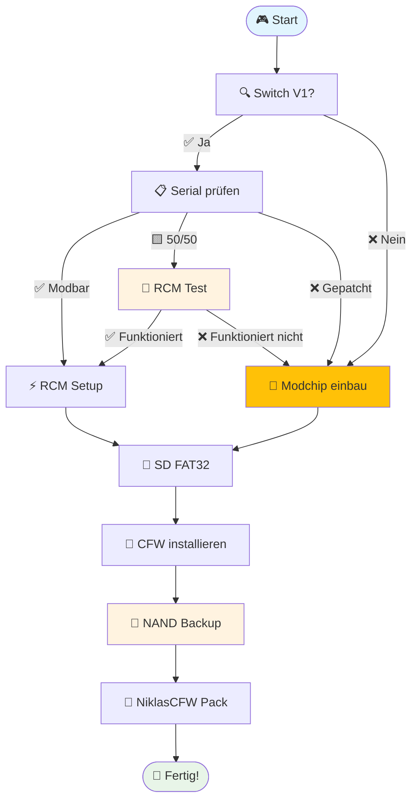

# Nintendo Switch CFW Dokumentation

  
  
Komplette Anleitung für Custom Firmware

---

## 🚀 **Schnellstart-Guide**

<h4 style="margin-top: 0; color: #28a745;">💡 Neu hier? Starte hier!</h4>

Folge diesem <strong>linearen Pfad</strong> für die beste Erfahrung:

<h3>🔍 1. Vorbereitung</h3>

Hardware prüfen & SD-Karte vorbereiten

<ul style="margin: 1rem 0;">
<li>✅ <a href="vorbereitung/switch_ungepatcht_check">Switch Modell prüfen</a></li>
<li>💾 <a href="vorbereitung/richtige_sd">Richtige SD-Karte</a></li>
<li>⚡ <a href="vorbereitung/rcm-methode/">RCM Methoden</a></li>
</ul>

<h3>🛠️ 2. Installation</h3>

CFW installieren & einrichten

<ul style="margin: 1rem 0;">
<li>🎯 <a href="switch_v1_softmod_guide">V1 Softmod Guide</a></li>
<li>💾 <a href="nand_backup">NAND Backup erstellen</a></li>
<li>📦 <a href="niklascfw-pack/">NiklasCFW Pack</a></li>
</ul>

<h3>⚙️ 3. Nachher</h3>

System optimieren & anpassen

<ul style="margin: 1rem 0;">
<li>🚀 <a href="nachher/autoboot_aktivieren">Autoboot aktivieren</a></li>
<li>📱 <a href="nachher/forwarder_installieren">Forwarder installieren</a></li>
<li>🎨 <a href="gut-zu-wissen/customization/theme_install/">Theme Installation</a></li>
</ul>

---

## 📚 **Alle Guides**

### 🔧 **Hauptguides**
- 🎮 **[Switch V1 Softmod Guide](erweiterte-guides/switch_v1_softmod_guide)** - Der Hauptguide für modbare Switches
- 🔄 **[OFW zu emuMMC Guide](erweiterte-guides/ofw_to_emummc_guide)** - Sicher von Stock zu CFW wechseln
- 💾 **[NAND Backup](system-backup/nand_backup)** - Deine Konsole sichern
- 🔧 **[NAND Backup & Restore](system-backup/nand_backup_restore)** - Vollständige Wiederherstellung

### 💾 **Backup & Wartung**
- 💽 **[SD Partition Backup und Restore](system-backup/sd_partition_backup_restore)** - SD-Karte sichern
- 🛠️ **[Ultrahand](gut-zu-wissen/apps-tools/ultrahand)** - Erweiterte System-Tools

### 🎮 **Apps & Games**
- 🎯 **[RetroArch Installation](gut-zu-wissen/erweiterte-systeme/retroarch_install)** - Retro Gaming Setup
- 📦 **Game Installation Guides** (in Gut zu wissen)

---

## 💡 **Erweiterte Themen**

<h3>🧠 Gut zu wissen</h3>

Tipps, Tricks & wichtige Infos

<a href="gut-zu-wissen/" style="color: #ffc107; text-decoration: none;">→ Entdecken</a>

<h3>🆘 Fehlerbehebung</h3>

Probleme? Hier findest du Lösungen

<a href="fehlerbehebung/" style="color: #ffc107; text-decoration: none;">→ Hilfe holen</a>

<h3>🎯 NiklasCFW Pack</h3>

Das komplette CFW-Paket

<a href="niklascfw-pack/" style="color: #ffc107; text-decoration: none;">→ Download</a>

---

## ⚠️ **Wichtige Sicherheitshinweise**

<h4 style="margin-top: 0; color: #dc3545;">🚨 KRITISCH - Lies das ZUERST!</h4>
<ul style="margin-bottom: 0;">
<li>💾 <strong>NAND Backup ist PFLICHT</strong> - Ohne Backup = Brick-Risiko!</li>
<li>🚫 <strong>Niemals exFAT verwenden</strong> - Nur FAT32 für SD-Karten</li>
<li>🎯 <strong>Aktuelle Versionen</strong> - Alte CFW kann Probleme verursachen</li>
<li>🔒 <strong>90DNS/Incognito</strong> - Online-Schutz aktivieren</li>
</ul>

<h4 style="margin-top: 0; color: #b8860b;">⚖️ Rechtliche Hinweise</h4>
<ul style="margin-bottom: 0;">
<li>📖 Diese Guides sind nur für <strong>Bildungszwecke</strong></li>
<li>⚖️ <strong>Homebrew ≠ Piraterie</strong> - Respektiere Urheberrechte</li>
<li>🛡️ <strong>Garantieverlust</strong> bei Modifikationen möglich</li>
<li>🎮 <strong>Nintendo-Konten</strong> können gesperrt werden</li>
</ul>

---

## 🎯 **Empfohlener Installations-Ablauf**

---

## 📱 **Mobile Navigation**

<strong>📖 Alle Guides (Klicken zum Aufklappen)</strong>

### 🔧 Installation
- [Switch V1 Softmod Guide](erweiterte-guides/switch_v1_softmod_guide)
- [OFW zu emuMMC Guide](erweiterte-guides/ofw_to_emummc_guide)
- [NAND Backup](system-backup/nand_backup)

### 💾 Wartung
- [SD Partition Backup und Restore](system-backup/sd_partition_backup_restore)
- [NAND Backup & Restore](system-backup/nand_backup_restore)
- [Ultrahand](gut-zu-wissen/apps-tools/ultrahand)

### 🎮 Apps
- [RetroArch Installation](gut-zu-wissen/erweiterte-systeme/retroarch_install)

### 📚 Wissen
- [Gut zu wissen](gut-zu-wissen/)
- [Fehlerbehebung](fehlerbehebung/)
- [NiklasCFW Pack](niklascfw-pack/)

---

  <h2>🎉 Erfolgreich modded?</h2>
  
Teile deine Erfahrung und hilf anderen!

  

    <a href="https://youtube.com/@NiklasCFW" style="background: #ff0000; color: white; padding: 0.8rem 1.5rem; border-radius: 6px; text-decoration: none;">📺 YouTube</a>
    <a href="https://serialcheck.niklascfw.de" style="background: #007bff; color: white; padding: 0.8rem 1.5rem; border-radius: 6px; text-decoration: none;">🔍 Serial Check</a>
  

