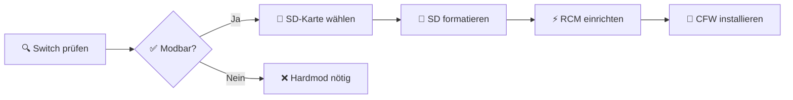

# 🔍 Vorbereitung

Bevor du mit der Installation von Custom Firmware auf deiner Nintendo Switch beginnst, musst du einige wichtige Vorbereitungsschritte durchführen. Diese Checkliste führt dich Schritt für Schritt durch alles, was vor der eigentlichen CFW-Installation wichtig ist.

---

## 📋 Vorbereitungs-Checkliste

### 1️⃣ **Switch Modell prüfen**
- 🔍 [Switch Modell prüfen](switch_ungepatcht_check) - Ist deine Switch modbar?
- ⚠️ Nur **ungepatchte Switch V1** (2017-2018) können per Softmod modifiziert werden
- 🎮 Switch V2, OLED und Lite benötigen einen Hardmod (Modchip)

### 2️⃣ **SD-Karte vorbereiten**
- 💾 [Richtige SD-Karte](richtige_sd) - Welche Speicherkarte ist die beste Wahl?
- 🔧 [SD auf FAT32 formatieren](sd_format) - FAT32 ist **Pflicht** für CFW!

### 3️⃣ **RCM-Methode einrichten**
- ⚡ [RCM Methode](rcm-methode/) - Anleitungen für Windows, macOS und Linux
- 🎯 RCM ist der Standardweg für ungepatchte Switch V1 Konsolen

---

## 🎯 **Empfohlene Reihenfolge**

---

## ⚠️ **Wichtige Hinweise**

<h4 style="margin-top: 0; color: #b8860b;">💡 Bevor du startest</h4>
<ul style="margin-bottom: 0;">
<li>📖 <strong>Lies alle Anleitungen</strong> vollständig durch</li>
<li>💾 <strong>FAT32 ist Pflicht</strong> - exFAT funktioniert nicht!</li>
<li>🎯 <strong>Qualität der SD-Karte</strong> ist entscheidend für Performance</li>
<li>⚡ <strong>RCM-Jig vorsichtig</strong> verwenden - nicht dauerhaft stecken lassen</li>
</ul>

<h4 style="margin-top: 0; color: #dc3545;">🚨 Kritisch</h4>
<ul style="margin-bottom: 0;">
<li>🚫 <strong>Niemals exFAT verwenden</strong> - nur FAT32!</li>
<li>🔋 <strong>Akku-Stand</strong> - mindestens 50% vor Start</li>
<li>💾 <strong>Backup vorhanden?</strong> - Wichtig für später!</li>
</ul>

---

## 📚 **Weiterführende Links**

Nach der Vorbereitung kannst du mit der eigentlichen CFW-Installation beginnen:

- 🚀 [CFW Installation](/Switch/erweiterte-guides/switch_v1_softmod_guide) - Der Hauptguide
- 💾 [NAND Backup](/Switch/system-backup/nand_backup) - Sicherheit zuerst!
- 🎯 [NiklasCFW Pack](/Switch/niklascfw-pack/) - Alles-in-einem Paket

---

  <h3>✅ Bereit?</h3>
  
Wenn alle Vorbereitungsschritte abgeschlossen sind, kannst du mit der CFW-Installation beginnen!

  <a href="/Switch/erweiterte-guides/switch_v1_softmod_guide" style="background: white; color: #667eea; padding: 0.8rem 1.5rem; border-radius: 6px; text-decoration: none; font-weight: bold;">🚀 CFW Installation starten →</a>

