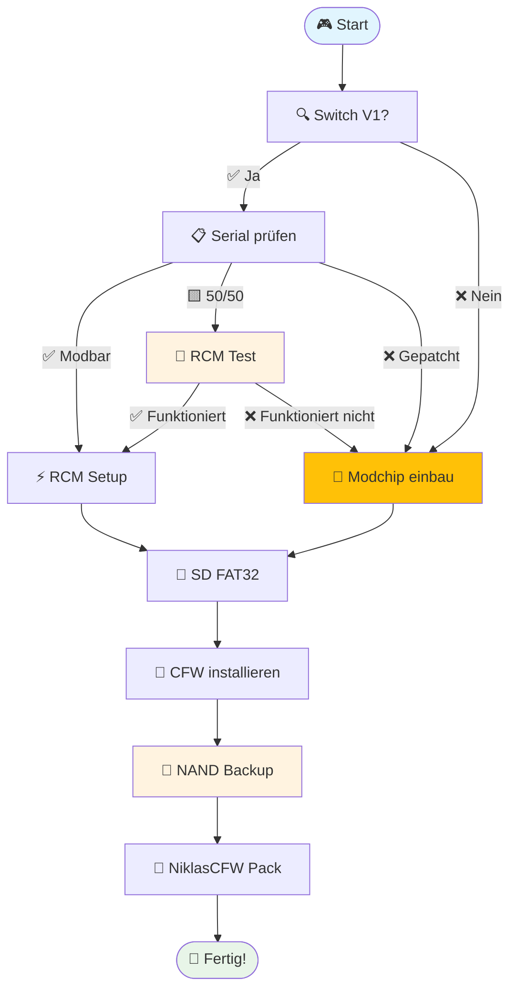

# Willkommen bei den NiklasCFW Docs

---

## 📚 Was findest du hier?

Diese Dokumentation bietet dir **alles**, was du für die Einrichtung und Nutzung von Custom Firmware auf der Nintendo Switch benötigst:

### 🚀 **Schnellstart**
- ✅ **[Switch Modell prüfen](/Switch/vorbereitung/switch_ungepatcht_check)** - Ist deine Switch modbar?
- ✅ **[SD-Karte vorbereiten](/Switch/vorbereitung/richtige_sd)** - Die richtige Ausstattung
- ✅ **[CFW Installation](/Switch/erweiterte-guides/switch_v1_softmod_guide)** - Der Hauptguide

### 🛠️ **Erweiterte Features**
- 🎯 **[NiklasCFW Pack](/Switch/niklascfw-pack/)** - Alles-in-einem Paket
- 💾 **[NAND Backup](/Switch/system-backup/nand_backup)** - Sicherheit zuerst!
- 🎨 **[Themes & Customization](/Switch/gut-zu-wissen/customization/theme_install)** - Switch individuell gestalten
- 🎮 **[Game Installation](/Switch/gut-zu-wissen/)**
- 🔧 **[RetroArch Setup](/Switch/gut-zu-wissen/erweiterte-systeme/retroarch_install)**

### 🆘 **Support & Troubleshooting**
- 🔧 **[Fehlerbehebung](/Switch/fehlerbehebung/)** - Häufige Probleme lösen
- 📱 **[Serialchecker](https://serialcheck.niklascfw.de)** - Online Tool
- 💬 **[Discord Community](https://discord.gg/niklascfw)** - Hilfe von anderen Nutzern

---

## ⚠️ **Wichtige Hinweise**

<h4 style="margin-top: 0; color: #b8860b;">⚠️ Bevor du startest</h4>
<ul style="margin-bottom: 0;">
<li>📖 <strong>Lies ALLE Anleitungen</strong> vollständig durch</li>
<li>💾 <strong>Erstelle IMMER ein NAND Backup</strong> vor Modifikationen</li>
<li>🎯 <strong>Verwende nur aktuelle Versionen</strong> aller Tools</li>
<li>🚫 <strong>Nutze niemals exFAT</strong> - nur FAT32!</li>
</ul>

<h4 style="margin-top: 0; color: #17a2b8;">⚖️ Rechtliches</h4>
<ul style="margin-bottom: 0;">
<li>Diese Guides sind nur für <strong>Bildungszwecke</strong></li>
<li><strong>Du</strong> trägst die Verantwortung für deine Konsole</li>
<li><strong>Garantieverlust</strong> ist möglich</li>
</ul>

---

## 🎯 **Schnellzugriff nach Gerät**

<h3>🎮 Switch V1 (2017-2018)</h3>

<strong>✅ Vollständig modbar</strong>

RCM + Softmod möglich

<a href="/Switch/switch_v1_softmod_guide" style="background: #28a745; color: white; padding: 0.5rem 1rem; border-radius: 4px; text-decoration: none;">→ Guide starten</a>

<h3>🎮 Switch V2/OLED/Lite</h3>

<strong>❌ Nicht modbar</strong>

Hardmod erforderlich

<a href="/Switch/vorbereitung/switch_ungepatcht_check" style="background: #dc3545; color: white; padding: 0.5rem 1rem; border-radius: 4px; text-decoration: none;">→ Prüfen</a>

---

## 📈 **Empfohlener Installations-Ablauf**

---

## 🔗 **Nützliche Links**

| Tool | Beschreibung | Link |
|------|-------------|------|
| 🔍 **Serialchecker** | Prüfe deine Switch | [serialcheck.niklascfw.de](https://serialcheck.niklascfw.de) |
| 📺 **YouTube** | Video-Tutorials | [@NiklasCFW](https://youtube.com/@NiklasCFW) |
| 💬 **Discord** | Community Support | [discord.gg/niklascfw](https://discord.gg/niklascfw) |
| 📱 **GitHub** | Source Code | [NiklasCFW Pack GitHub Repo](https://github.com/Woody-NX/NiklasCFW_Pack) |

---

## 🆕 **Was ist neu?**

<h4 style="margin-top: 0; color: #28a745;">💡 Aktuelle Updates</h4>
<ul style="margin-bottom: 0;">
<li>✨ <strong>Komplett überarbeitete Struktur</strong> mit besserer Navigation</li>
<li>🎯 <strong>NiklasCFW Pack</strong> - Alles-in-einem Paket</li>
<li>📱 <strong>Mobile-optimierte</strong> Darstellung</li>
<li>🔄 <strong>Regelmäßige Updates</strong> für neue Firmware-Versionen</li>
</ul>

---

  <h2 style="margin-bottom: 1rem;">🚀 Bereit loszulegen?</h2>
  
Starte jetzt mit der Modifikation deiner Nintendo Switch!

  <a href="/Switch/" style="background: white; color: #667eea; padding: 1rem 2rem; border-radius: 6px; text-decoration: none; font-weight: bold; font-size: 1.1em;">📖 Zur Dokumentation →</a>

 

Test

