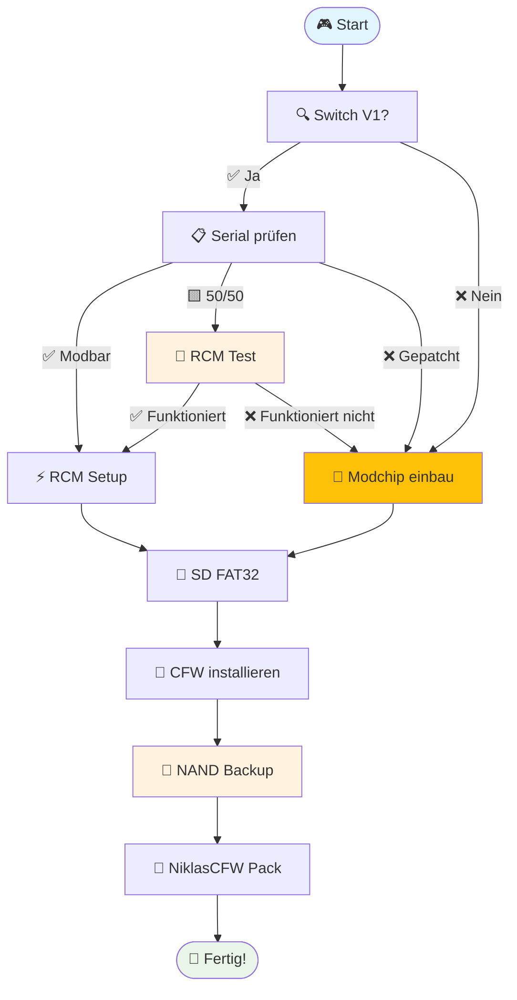

# Willkommen bei den NiklasCFW Docs

Diese Dokumentation führt dich durch **Vorbereitung**, **Backups**, **Nachbereitung**, **Vertiefung** und **CFW-Pakete** rund um die Nintendo Switch. Das **Inhaltsverzeichnis** folgt der **Reihenfolge der Seitenleiste** (unter „Nintendo Switch“); darunter Kurzinfos, Hinweise und empfohlene Abläufe.

<nav class="niklas-toc" aria-label="Inhaltsverzeichnis">

<h2 class="niklas-toc-title">Inhaltsverzeichnis</h2>

<ul class="niklas-toc-branches">

<li>
  
1. Vorbereitung

  <ul class="niklas-toc-links">
    <li><a href="/switch/vorbereitung/switch_ungepatcht_check">1.1 Switch Modell prüfen</a></li>
    <li><a href="/switch/vorbereitung/richtige_sd">1.2 Richtige SD-Karte</a></li>
    <li><a href="/switch/vorbereitung/sd_format">1.3 SD auf FAT32 formatieren</a></li>
    <li><a href="/switch/vorbereitung/rcm-methode/switch_v1_softmod_windows">1.4 RCM Softmod – Windows</a></li>
    <li><a href="/switch/vorbereitung/rcm-methode/switch_v1_softmod_mac">1.5 RCM Softmod – macOS</a></li>
    <li><a href="/switch/vorbereitung/rcm-methode/switch_v1_softmod_linux">1.6 RCM Softmod – Linux, Android, ChromeOS</a></li>
  </ul>
</li>

<li>
  
2. System &amp; Backup

  <ul class="niklas-toc-links">
    <li><a href="/switch/system-backup/sd_partition_backup_restore">2.1 SD Partition Backup und Restore</a></li>
    <li><a href="/switch/system-backup/nand_backup_restore">2.2 NAND Backup wiederherstellen</a></li>
    <li><a href="/switch/system-backup/nand_backup">2.3 NAND Backup erstellen</a></li>
  </ul>
</li>

<li>
  
3. Nachher

  <ul class="niklas-toc-links">
    <li><a href="/switch/nachher/auto_rcm_aktivieren">3.1 Auto RCM aktivieren</a></li>
    <li><a href="/switch/nachher/autoboot_aktivieren">3.2 Autoboot aktivieren</a></li>
    <li><a href="/switch/nachher/forwarder_installieren">3.3 Forwarder installieren</a></li>
    <li><a href="/switch/nachher/dbi_time">3.4 Uhrzeit mit DBI (NTP)</a></li>
  </ul>
</li>

<li>
  
4. Gut zu wissen

  

    

      
4.1 Apps &amp; Tools

      <ul class="niklas-toc-links">
        <li><a href="/switch/gut-zu-wissen/apps-tools/ultrahand_cfwpack">UltraHand im Pack</a></li>
        <li><a href="/switch/gut-zu-wissen/apps-tools/ultrahand">UltraHand</a></li>
        <li><a href="/switch/gut-zu-wissen/apps-tools/sphaira">Sphaira</a></li>
        <li><a href="/switch/gut-zu-wissen/apps-tools/prodkeys">prod.keys (Lockpick)</a></li>
        <li><a href="/switch/gut-zu-wissen/apps-tools/jksv_cloud">JKSV Cloud</a></li>
        <li><a href="/switch/gut-zu-wissen/apps-tools/jksv">JKSV (Spielstände)</a></li>
        <li><a href="/switch/gut-zu-wissen/apps-tools/hb_cfw_tools">Homebrew &amp; CFW Tools</a></li>
      </ul>
    

    

      
4.2 System

      <ul class="niklas-toc-links">
        <li><a href="/switch/gut-zu-wissen/system/emummc_downgrade">emuMMC (Partition) downgraden</a></li>
        <li><a href="/switch/gut-zu-wissen/system/switch_ruecksetzmodus">Zurücksetzen / Werkseinstellungen</a></li>
        <li><a href="/switch/gut-zu-wissen/system/nxmigatorpro">NX Migrator Pro</a></li>
        <li><a href="/switch/gut-zu-wissen/system/emummc_arten">emuMMC-Typen</a></li>
      </ul>
    

    

      
4.3 Spiele

      <ul class="niklas-toc-links">
        <li><a href="/switch/gut-zu-wissen/spiele/ofw_to_emummc_guide">OFW zu emuMMC Guide</a></li>
        <li><a href="/switch/gut-zu-wissen/spiele/sphaira_games_und_updates_aus_der_ofw_dumpen">Sphaira: OFW-Dumps</a></li>
        <li><a href="/switch/gut-zu-wissen/spiele/gamecard_mit_spaira_dumpen">Gamecard dumpen (Sphaira)</a></li>
        <li><a href="/switch/gut-zu-wissen/spiele/backups-installieren">Backups installieren</a></li>
        <li><a href="/switch/gut-zu-wissen/spiele/spiele_installation_dbi_sphaira">Spiele installieren (DBI/Sphaira)</a></li>
      </ul>
    

    

      
4.4 Customization

      <ul class="niklas-toc-links">
        <li><a href="/switch/gut-zu-wissen/customization/title_override">Title Override</a></li>
        <li><a href="/switch/gut-zu-wissen/customization/theme_install">Themes installieren</a></li>
      </ul>
    

    

      
4.5 Erweiterte Systeme

      <ul class="niklas-toc-links">
        <li><a href="/switch/gut-zu-wissen/erweiterte-systeme/retroarch_install">RetroArch</a></li>
        <li><a href="/switch/gut-zu-wissen/erweiterte-systeme/lakka_install">Lakka</a></li>
        <li><a href="/switch/gut-zu-wissen/erweiterte-systeme/android-und-linux-installieren-ultrahand">Android &amp; Linux (Ultrahand)</a></li>
      </ul>
    

  

</li>

<li>
  
5. Fehlerbehebung

  

    

      
5.1 System &amp; Boot

      <ul class="niklas-toc-links">
        <li><a href="/switch/fehlerbehebung/system-boot/hekate_fix_archive_bits">Hekate – Fix Archive Bits</a></li>
        <li><a href="/switch/fehlerbehebung/system-boot/21230011_beheben">Fehlercode 2123-0011 (Switch) – kein Game geht mehr auf</a></li>
        <li><a href="/switch/fehlerbehebung/system-boot/0100000000000bd00_beheben">Fehlercode 0100000000000bd00 beheben</a></li>
        <li><a href="/switch/fehlerbehebung/system-boot/420000000000010_beheben_(ldn_mitm)">Fehlercode 420000000000010 beheben (ldn_mitm)</a></li>
        <li><a href="/switch/fehlerbehebung/system-boot/fehlercode_2001-0123_ultrahand_anleitung">Fehlercode 2001-0123 – UltraHand</a></li>
      </ul>
    

    

      
5.2 Apps &amp; Tools

      <ul class="niklas-toc-links">
        <li><a href="/switch/fehlerbehebung/apps-tools/niklascfwdownloadprobleme">NiklasCFW Downloader Fehlerbehebung</a></li>
        <li><a href="/switch/fehlerbehebung/apps-tools/ultrahand_oeffnen">UltraHand öffnen</a></li>
      </ul>
    

    

      
5.3 Theme &amp; Visual

      <ul class="niklas-toc-links">
        <li><a href="/switch/fehlerbehebung/theme-visual/0100000000000001000_beheben_(custom_theme)">Fehlercode 0100000000000001000 beheben (Custom Theme entfernen)</a></li>
        <li><a href="/switch/fehlerbehebung/theme-visual/leere_lade_icons_switch_dbifix">Fix: Leere Lade-Icons auf dem Switch Home-Menü (DBI)</a></li>
      </ul>
    

    

      
5.4 Hardware

      <ul class="niklas-toc-links">
        <li><a href="/switch/fehlerbehebung/hardware/switch_macbook">Switch mit MacBook verbinden</a></li>
      </ul>
    

    

      
5.5 Spiele

      <ul class="niklas-toc-links">
        <li><a href="/switch/fehlerbehebung/spiele/plza_save">Defekten Legenden Z-A Spielstand reparieren</a></li>
      </ul>
    

  

</li>

<li>
  
6. Erweiterte Guides

  <ul class="niklas-toc-links">
    <li><a href="/switch/erweiterte-guides/ofw_to_emummc_guide">6.1 OFW zu emuMMC Guide</a></li>
  </ul>
</li>

<li>
  
7. NiklasCFW Pack

  <ul class="niklas-toc-links">
    <li><a href="/switch/niklascfw-pack/guide1.4.0">7.1 Ersteinrichtung 1.5.0</a></li>
    <li><a href="/switch/niklascfw-pack/guide1">7.2 Ersteinrichtung Alt</a></li>
    <li><a href="/switch/niklascfw-pack/guide2">7.3 emuMMC erstellen</a></li>
    <li><a href="/switch/niklascfw-pack/guide3">7.4 Pack einrichten</a></li>
    <li><a href="/switch/niklascfw-pack/guide4">7.5 CFW Pack Update</a></li>
    <li><a href="/switch/niklascfw-pack/guide5">7.6 emuMMC Firmware Update</a></li>
  </ul>
</li>

<li>
  
8. OmniNX

  <ul class="niklas-toc-links">
    <li><a href="/switch/omninx/einfuehrung">8.1 Einführung</a></li>
    <li><a href="/switch/omninx/voraussetzungen">8.2 Voraussetzungen</a></li>
    <li><a href="/switch/omninx/download">8.3 Download</a></li>
    <li><a href="/switch/omninx/installation_omninx">8.4 Installation</a></li>
    <li><a href="/switch/omninx/emummc_erstellen">8.5 emuMMC erstellen</a></li>
    <li><a href="/switch/omninx/pack_einrichten">8.6 Pack einrichten</a></li>
    <li><a href="/switch/omninx/overclocking">8.7 Overclocking (OC)</a></li>
    <li><a href="/switch/omninx/updates/firmware-update">8.8 Switch Firmware</a></li>
    <li><a href="/switch/omninx/updates/omninx-update">8.9 OmniNX Pack</a></li>
  </ul>
</li>

</ul>

</nav>

---

## 🎯 **Schnellzugriff nach Gerät**

<h3>🎮 Switch V1 (2017-2018)</h3>

<strong>✅ Vollständig modbar</strong>

RCM + Softmod möglich

<a href="/switch/vorbereitung/rcm-methode/switch_v1_softmod_windows" style="background: #28a745; color: white; padding: 0.5rem 1rem; border-radius: 4px; text-decoration: none;">→ Guide starten</a>

<h3>🎮 Switch V2/OLED/Lite</h3>

<strong>❌ Nicht modbar</strong>

Hardmod erforderlich

<a href="/switch/vorbereitung/switch_ungepatcht_check" style="background: #dc3545; color: white; padding: 0.5rem 1rem; border-radius: 4px; text-decoration: none;">→ Prüfen</a>

---

## 📈 **Empfohlener Installations-Ablauf**

---

## 🔗 **Nützliche Links**

| Tool | Beschreibung | Link |
|------|-------------|------|
| 🔍 **Serialchecker** | Prüfe deine Switch | [serialcheck.niklascfw.de](https://serialcheck.niklascfw.de) |
| 📺 **YouTube** | Video-Tutorials | [@NiklasCFW](https://youtube.com/@NiklasCFW) |
| 💬 **Discord** | Community Support | [discord.gg/niklascfw](https://discord.gg/niklascfw) |
| 📱 **GitHub** | Source Code | [NiklasCFW Pack GitHub Repo](https://github.com/Woody-NX/NiklasCFW_Pack) |

---

## 🆕 **Was ist neu?**

<h4 style="margin-top: 0; color: #28a745;">💡 Aktuelle Updates</h4>
<ul style="margin-bottom: 0;">
<li>✨ <strong>Komplett überarbeitete Struktur</strong> mit besserer Navigation</li>
<li>🎯 <strong>NiklasCFW Pack</strong> - Alles-in-einem Paket</li>
<li>📱 <strong>Mobile-optimierte</strong> Darstellung</li>
<li>🔄 <strong>Regelmäßige Updates</strong> für neue Firmware-Versionen</li>
</ul>

---

  <h2 style="margin-bottom: 1rem;">🚀 Bereit loszulegen?</h2>
  
Starte jetzt mit der Modifikation deiner Nintendo Switch!

  <a href="/switch/" style="background: white; color: #667eea; padding: 1rem 2rem; border-radius: 6px; text-decoration: none; font-weight: bold; font-size: 1.1em;">📖 Zur Dokumentation →</a>

